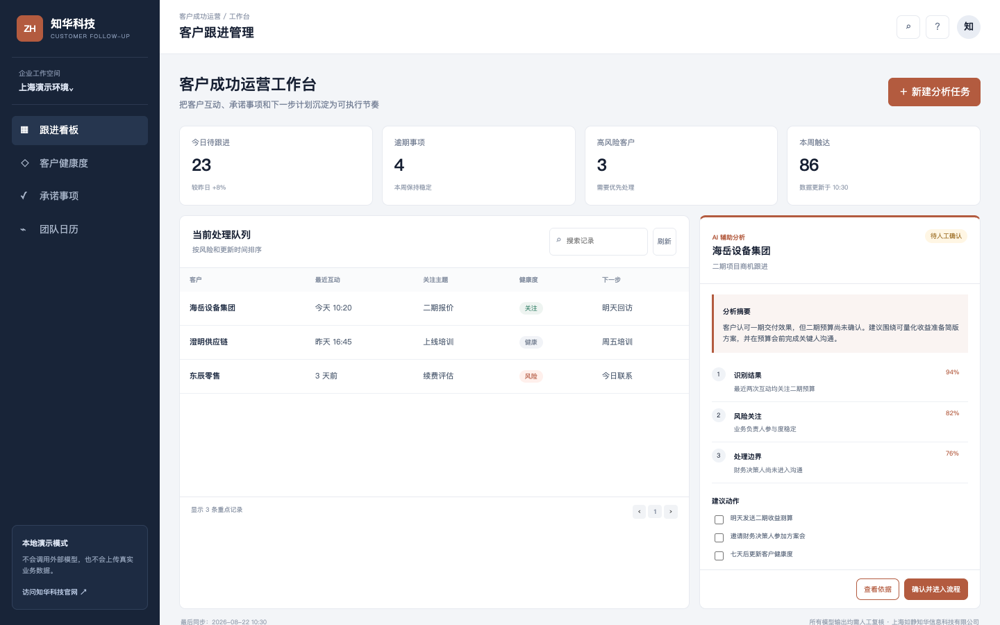

# ZhuaTech Customer Follow-up｜知华科技客户跟进管理系统

## 企业级客户触达治理

新增客户授权、禁止联系、责任人、投诉状态和跟进节奏控制，详见 [客户触达治理](docs/ENTERPRISE_CONTACT_GOVERNANCE.md)。

ZhuaTech Customer Follow-up 是上海如静知华信息科技有限公司面向“客户成功运营”场景推出的社区源码项目。面向销售和客户成功团队的客户跟进节奏管理系统。把客户互动、承诺事项和下一步计划沉淀为可执行节奏。

[知华科技官网](https://www.zhuatech.cn/) · Java 包名 `cn.zhuatech.customerfollowup` · API `POST /api/customerfollowup/run`

> 工程默认执行本地确定性演示逻辑，不内置模型、密钥和第三方数据。已预留 DeepSeek 兼容配置，使用者可自行接入并承担数据授权、输出复核和业务合规责任。



界面围绕真实业务队列组织：上方展示核心运营指标，中间并列呈现处理队列与辅助分析，关键结论提供置信度、依据和人工确认入口，避免把模型输出直接写入正式业务。

## 从业务队列开始，而不是从聊天框开始

| 模块 | 社区源码版能力 |
| --- | --- |
| 跟进看板 | 最近两次互动均关注二期预算 |
| 客户健康度 | 业务负责人参与度稳定 |
| 承诺事项 | 明天发送二期收益测算 |
| 团队日历 | 邀请财务决策人参加方案会 |
| AI 扩展 | 本地演示管线、DeepSeek 兼容请求载荷、置信度阈值与人工复核状态 |
| 工程能力 | Java 21、Spring Boot 4、H5、MySQL 8、Docker Compose、JUnit 自动化测试 |

## 工程结构

`backend/` 提供可验证的 Java API，`frontend/` 是可直接运行的响应式 H5 工作台，`database/schema.sql` 给出 MySQL 业务表与审计表，`docs/images/` 保存实际页面截图。

## 本地运行

```bash
cd backend
mvn spring-boot:run
```

直接打开 `frontend/index.html` 即可使用前端演示；也可以运行完整容器：

```bash
docker compose up --build
```

访问 `http://localhost:8088`。即使后端未启动，页面仍会返回相同结构的本地演示结果。

## DeepSeek 接入预留

```dotenv
ZHUATECH_LLM_PROVIDER=local
ZHUATECH_LLM_BASE_URL=https://api.deepseek.com
ZHUATECH_LLM_MODEL=deepseek-chat
ZHUATECH_LLM_API_KEY=
```

建议在 `WorkspaceService` 外增加 Provider 接口，将外部调用放入独立适配器；API Key 只通过环境变量或密钥管理服务注入，不提交到源码仓库。生产环境还应补充组织权限、数据脱敏、调用审计、限流、失败重试和人工确认。

## 负责任使用

- 只处理已获授权的数据，不得上传无权访问的客户、员工或个人信息。
- AI 结果属于辅助信息，不能替代业务负责人、专业人员或法定审批人的决定。
- 高风险结论、对外承诺和正式业务写入必须经过人工复核。
- 本仓库不包含真实业务数据、生产账号、模型密钥或第三方受版权保护的素材。

## 许可、咨询与商业服务

本工程仅限个人学习、研究和非商业技术交流，**不得商用**。企业内部生产使用、SaaS 部署、软件实施、模型接入、品牌定制与项目交付，均须获得上海如静知华信息科技有限公司书面授权，详见 [LICENSE](LICENSE)。

| 微信咨询一 | 微信咨询二 |
| --- | --- |
|  |  |

深度开发、中小企业 AI 转型和软件项目外包请访问：[https://www.zhuatech.cn/](https://www.zhuatech.cn/)

SEO：客户跟进系统,客户成功管理,商机跟进,客户健康度,销售AI,DeepSeek Java、企业 AI 转型、知华科技、上海软件外包、中小企业信息化。
